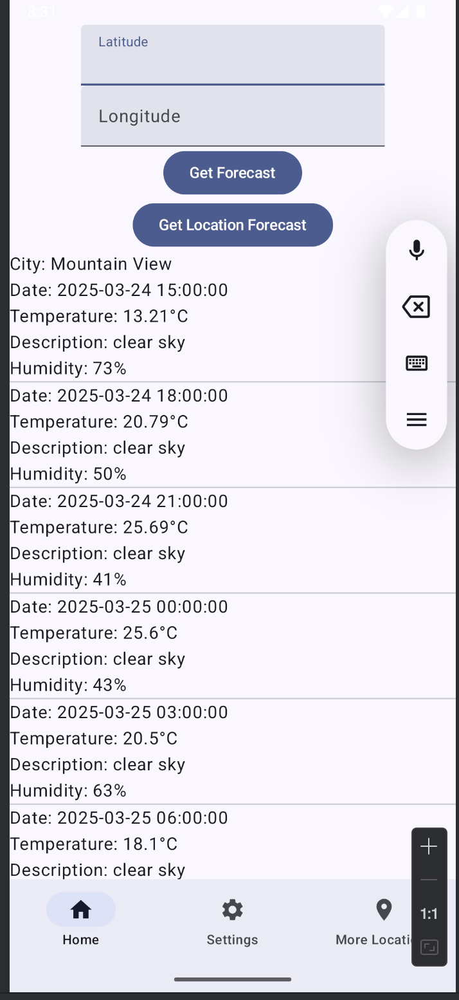

# weather_anirudh_03212025

# Weather Application Documentation

# 1. Introduction

* **Project Name**: Weather Application.
* **Description**: This application fetches and displays weather forecast data based on user-provided latitude
and longitude or the device's current location.
* **Purpose**: To provide users with accurate and up-to-date weather forecasts in a user-friendly interface.
* **Target** Audience: General users seeking weather information.

# 2. Architecture

* **Kotlin:** Programming language.
* **Android Jetpack Compose:** UI framework.
* **Hilt:** Dependency injection.
* **Retrofit:** Networking library.
* **OpenWeatherMap API**: Weather data source.
* **Navigation Compose.**
* **Architecture Pattern:** MVVM (Model-View-ViewModel)
* **Dependency Injection:** Hilt is used for dependency injection to manage dependencies and improve code testability.
* **Networking:** Retrofit is used to make network requests to the OpenWeatherMap API.

# 3. Modules and Components

**MainActivity.kt:**
* Entry point of the application.
* Sets up the Compose UI using setContent.
* Uses @AndroidEntryPoint for Hilt integration.

**WeatherApp.kt:**
* Composable function that manages navigation using NavHost.
* Implements bottom navigation using Scaffold and BottomNavigationBar.
* Defines navigation destinations (WeatherScreen, SettingsScreen, MoreLocationsScreen).

**WeatherScreen.kt:**
* Composable function that displays the main weather forecast screen.
* Contains UI elements for latitude/longitude input, forecast display, and location-based forecast.
* Handles location permissions and retrieves location data.
* Uses WeatherViewModel to fetch and manage forecast data.

**SettingsScreen.kt & MoreLocationsScreen.kt:**
* Simple composable functions for settings and more locations screens.
* Include back navigation.

**WeatherViewModel.kt:**
* ViewModel class that fetches and manages weather forecast data.
* Uses Retrofit and the OpenWeatherMap API.
* Handles location retrieval and error handling.
* Exposes forecast data and error messages as State objects.

**WeatherApi.kt:**
* Retrofit interface defining the API endpoints for the OpenWeatherMap API.

**AppModule.kt:**
Hilt module that provides dependencies like Retrofit and the API key.
**ForeCast.kt:**
Data classes that represent the JSON response from the OpenWeatherMap API.

# 4. Setup and Installation

**Prerequisites:**
* Android Studio installed.
* Android SDK configured.
* Gradle build system.

**Steps:**
* Clone the project repository.
* Open the project in Android Studio.
* Sync the Gradle files.
* Build and run the application on an emulator or physical device.
* Obtain an API key from OpenWeatherMap and replace the placeholder in AppModule.kt.

# 5. Usage

**Main Screen:**
Enter latitude and longitude manually to fetch the forecast.
Use the "Get Location Forecast" button to fetch the forecast based on the device's current location.
View the forecast details in the displayed UI.

**Bottom Navigation:**
Use the bottom navigation bar to switch between the main screen, settings, and more locations.

**Permissions:**
The app will request location permissions when the "Get Location Forecast" button is pressed.

# 6. Error Handling

**Network Errors:**
The app handles network errors and displays error messages to the user.

**Location Errors:**
The app displays an error message if the device's location cannot be retrieved.

**API Data Errors:**
The application is able to handle the error of the API returning float values instead of int values for the pop field.

# 7. Future Enhancements

* Implement a settings screen to allow users to customize units and other preferences.
* Add a map view to display weather information.
* Implement a more detailed forecast display.
* Add background location updates for real-time weather alerts.
* Add a list of saved locations.
* Add a search bar to search for locations.
* Add unit and UI tests.

# 8. Important Notes

* Ensure that you have a valid API key from OpenWeatherMap.
* Handle location permissions correctly to avoid app crashes.
* Test the app on various devices and screen sizes.

# 9. Data Model
The data model must be able to handle double values that are returned from the API, for the pop field.

# Call 5 day / 3 hour forecast data
5 day forecast is available at any location on the globe. It includes weather forecast data with 3-hour step.
Forecast is available in JSON or XML format.

